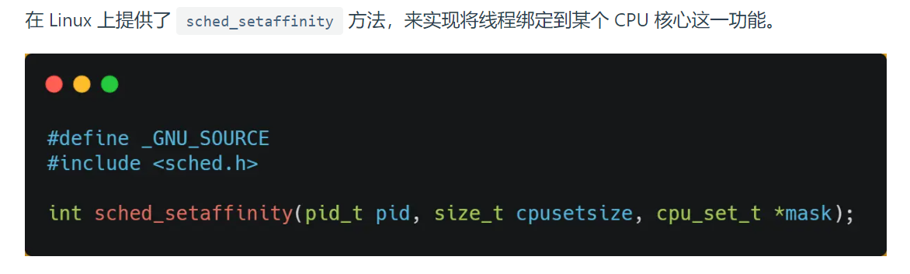
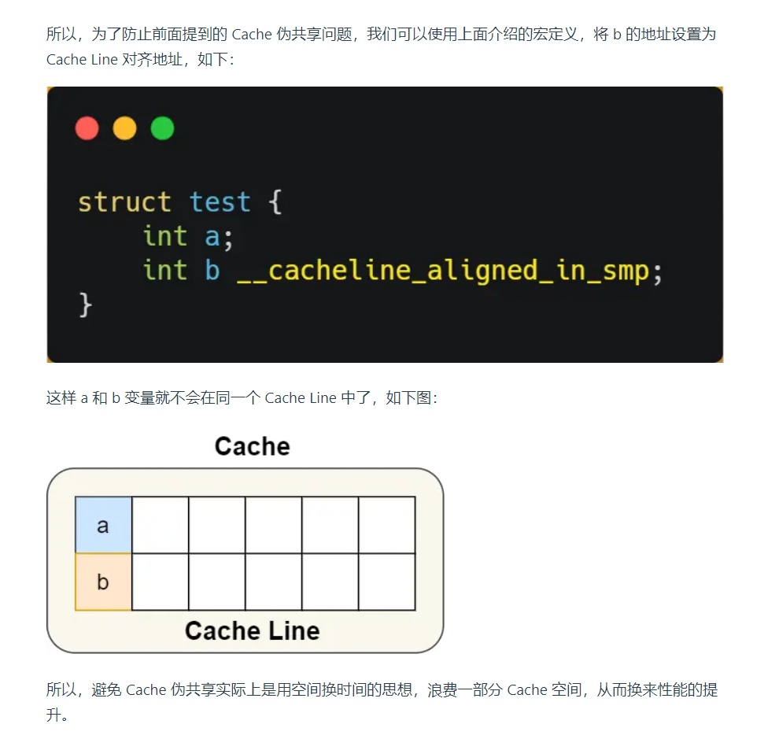
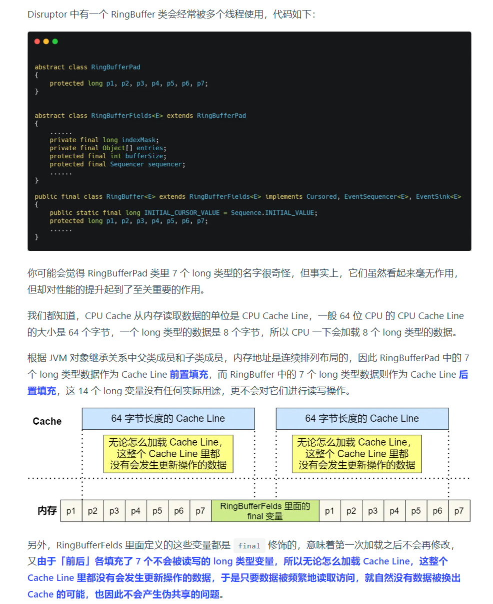

# 学习小林coding中的一些需要重复记忆的点
## 如何提升多核cpu缓存命中率
现代cpu大多为多核,一个线程可能在不同的核心中切换,前知cache多分为3级,其中l1,l2一般为单个核心独有,所以**在不同核心切换会导致命中率降低**所有我们有将线程绑定在单个核心的方法

## cpu缓存的一致性
不同的cpu有不同的cache,但是这其中有着相同的变量,我们需要保证这部分是一致的那么就会用到两个方法:  
1. 写传播,也就是说一个cache中数据变化,其他的也要变
2. 事务的串行化,也就是不能同时操作,这里就有一个锁的概念
  
而实现上述方法需用到两个协议
1. 总线嗅探,一个cache如果有变化,便广播变化,其他cache持续监听,如果自己也有相同变量就做相应变更,**但是相当占用总线负载**
2. mesi协议
    > 就是四个状态的缩写modified 已修改;exclusive 独占;shared 共享;invalidated 失效  
    当读取一个数据时,未共享数据,标记为独占exclusive,此时对该数据的所有操作都不需要广播  
    当有其他核心需要某个数据时会查询所有cache,如果已经有了就直接复制,此时所有同样的变量都变为共享shared  
    而对shared数据的修改会导致其他cache中的数据失效,该cache中的数据也变为已修改modified
    当要写回内存时,就需要同步
    当其他cache中的数据变为invalidated后,那么就相当于该数据未曾进入过cache,需要重新的查询其他cache和内存
## 解决伪共享问题
因为cache是按照cache行读取的内存数据,所以假设两个无关的变量处在同一个cache行中,那么就有可能被两个不同的核心不必要的频繁调用,导致未能达到共享的目的.  
**解决方法**就是  
1. 用一个宏定义将结构体中的数据强制对齐,让他们不属于同一个cache

2. 对于一些yongfinal定义的变量而言,显然是不需要被修改的,但是同行的其他数据可能会,因此我们就用一些空的数据填充该行

